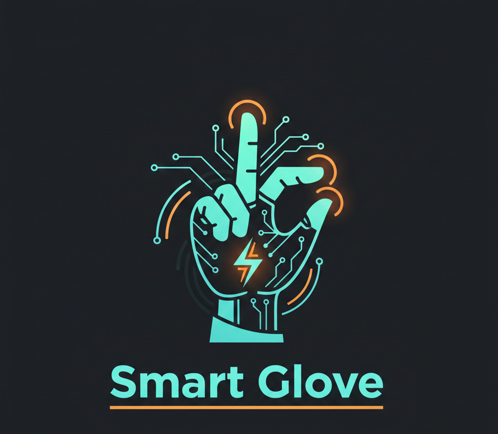
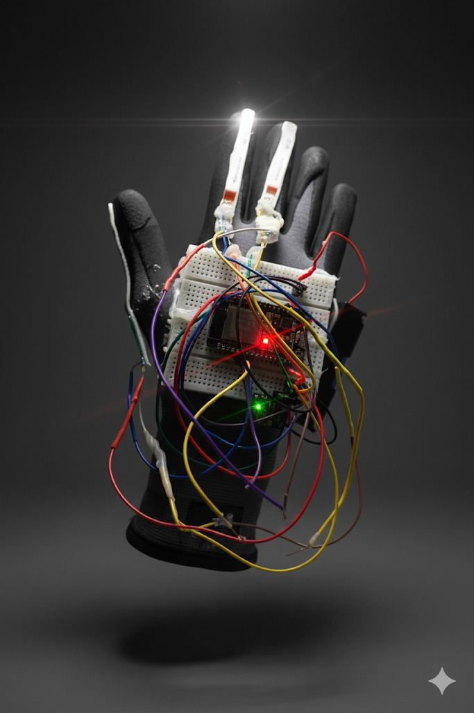
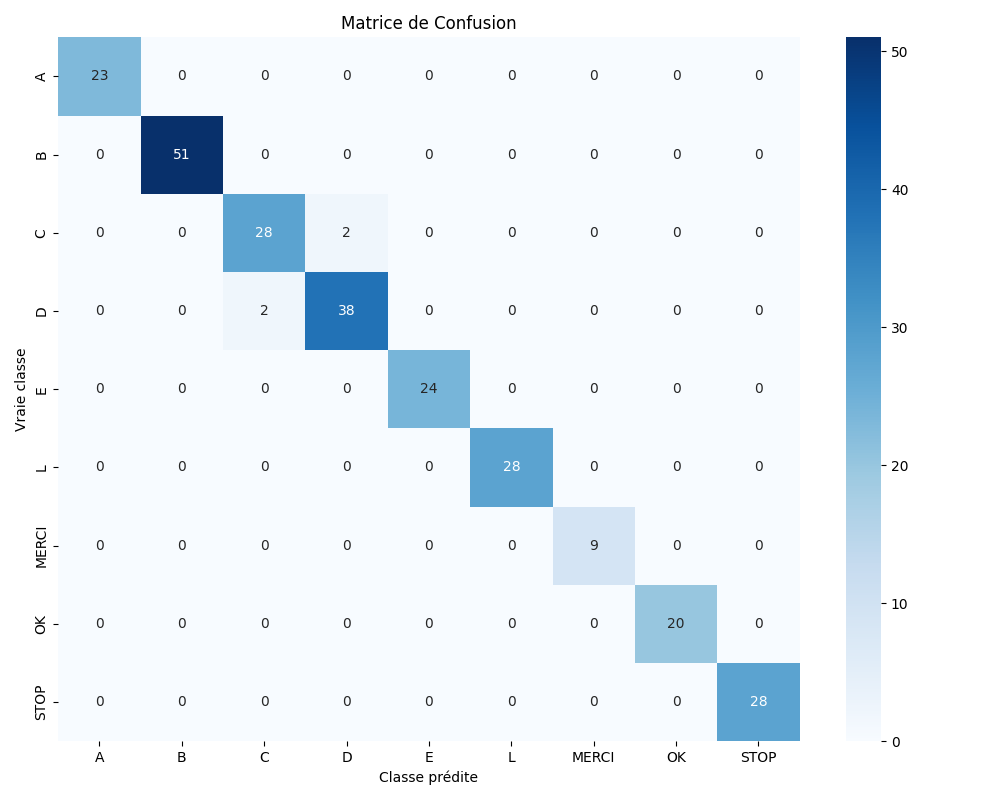

# Smart Glove - Sign Language Recognition System

<div align="center">



**Real-time AI-powered gesture recognition system for American Sign Language (ASL)**

[](https://www.python.org/)
[](https://flask.palletsprojects.com/)
[](https://reactjs.org/)
[](https://scikit-learn.org/)
[](https://www.espressif.com/)



</div>

---

## Table of Contents

- [About](#about)
- [Features](#features)
- [System Architecture](#system-architecture)
- [Model Performance](#model-performance)
- [Installation](#installation)
- [Usage](#usage)
- [Tech Stack](#tech-stack)
- [Team](#team)
- [License](#license)

---

## About

**Smart Glove** is an innovative real-time gesture recognition system designed to facilitate communication in American Sign Language (ASL). The project combines embedded hardware (ESP32), intelligent sensors, Machine Learning, and a modern web interface.

### Recognized Gestures

The system recognizes **6 distinct gestures**:
- **Letters**: A, B, D, F
- **Words**: OK, STOP

### Academic Context

Project developed as part of the Master's program in Embedded Systems and IoT - Semester 3

---

## Features

### AI & Machine Learning
- Random Forest classifier with 6 classes
- Overall accuracy: **>95%**
- Real-time prediction (<100ms)
- Manually labeled dataset (500+ samples)

### Embedded Hardware
- **ESP32** microcontroller
- **3 flex sensors** (thumb, index, middle finger)
- **MPU6050** (6-axis gyroscope + accelerometer)
- Real-time WiFi communication

### User Interface
- Modern responsive React dashboard
- **Integrated text-to-speech (TTS)**
- Real-time prediction visualization
- Detailed history and statistics
- Futuristic design with glassmorphism effects

### Audio Extension
- Configurable voice announcements (short/detailed)
- Voice gender selection (male/female/both)
- Instant audio feedback for each gesture

---

## System Architecture

### Overall Diagram

<div align="center">

</div>

### Data Flow

```
Sensors → ESP32 → POST /predict → Random Forest → Prediction
                                         ↓
                     React Dashboard ← GET /latest-prediction
                            ↓
                     Display + Audio
```

---

## Model Performance

### Confusion Matrix



### Key Metrics

| Metric | Value |
|--------|-------|
| **Accuracy** | >95% |
| **Average Precision** | 94-98% |
| **Prediction Time** | <100ms |
| **Dataset Size** | 500+ samples |

---

## Installation

### Prerequisites

- Python 3.8 or higher
- Node.js 16 or higher
- Git
- ESP32 (for hardware)

### Step 1: Clone the Repository

```bash
git clone https://github.com/SersifAbdeljalil/smart-glove-sign.git
cd smart-glove-sign
```

### Step 2: Project Structure

```
smart-glove-sign/
├── datasets/                    # Training data
├── glove_predictor.py          # Flask server + API
├── train_model.py              # ML training script
├── glove_model.pkl             # Random Forest model
├── scaler.pkl                  # Feature scaler
├── label_encoder.pkl           # Label encoder
├── confusion_matrix.png        # Visual results
└── smart-glove-frontend/       # React application
    ├── public/
    │   └── gestures/
    │       ├── LOGO.png        # Project logo
    │       ├── reel.png        # Glove photo
    │       ├── System Architecture.png  # Architecture diagram
    │       └── [A, B, D, F, ok, stop].png
    ├── src/
    │   ├── pages/
    │   │   └── Dashboard.js    # Main interface
    │   └── services/
    │       ├── api.js          # API client
    │       └── ttsService.js   # Text-to-speech
    └── package.json
```

### Step 3: Backend Installation (Flask)

```bash
# Install Python dependencies
pip install flask flask-cors joblib numpy scikit-learn pandas matplotlib seaborn
```

**Required libraries:**
```python
flask
flask-cors
joblib
numpy
scikit-learn
pandas
matplotlib
seaborn
```

### Step 4: Frontend Installation (React)

```bash
# Navigate to frontend directory
cd smart-glove-frontend

# Install Node.js dependencies
npm install

# Return to root directory
cd ..
```

---

## Usage

### Step 1: Start Flask Server

```bash
# From the root directory
python glove_predictor.py
```

**Expected output:**
```
Loading model...
Model loaded successfully!
Available labels: ['A', 'B', 'D', 'F', 'OK', 'STOP']

==================================================
  SMART GLOVE - PREDICTION INTERFACE
==================================================

Web interface: http://localhost:5000
React Dashboard: http://localhost:3000

Available endpoints:
   POST /predict - Prediction from ESP32
   GET /latest-prediction - Latest prediction (React)
   GET /stats - Statistics

==================================================
```

### Step 2: Start React Dashboard

```bash
# In a new terminal
cd smart-glove-frontend
npm start
```

The dashboard will open automatically at: `http://localhost:3000`

### Step 3: Test the System

#### Option A: Manual Test (without hardware)

Use the Flask web interface at `http://localhost:5000` to send test data.

#### Option B: With ESP32 Hardware

1. Configure ESP32 with WiFi credentials
2. Set Flask server IP address in ESP32 code
3. Upload code to ESP32
4. Make gestures with the glove
5. View predictions in real-time on the React dashboard

---

## API Endpoints

### POST /predict
Send sensor data for prediction

**Request:**
```json
{
  "flex_thumb": 512,
  "flex_index": 789,
  "flex_middle": 456,
  "gyro_x": 0.5,
  "gyro_y": -0.3,
  "gyro_z": 0.1,
  "accel_x": 9.8,
  "accel_y": 0.2,
  "accel_z": 0.1
}
```

**Response:**
```json
{
  "predicted_label": "A",
  "confidence": 96.5,
  "probabilities": {
    "A": 96.5,
    "B": 2.1,
    "D": 0.8
  },
  "timestamp": "2026-01-03T14:30:45"
}
```

### GET /latest-prediction
Get the last prediction made

**Response:**
```json
{
  "predicted_label": "OK",
  "confidence": 98.2,
  "timestamp": "2026-01-03T14:30:45"
}
```

### GET /stats
Get system statistics

**Response:**
```json
{
  "total_predictions": 150,
  "last_prediction": "STOP",
  "confidence": 95.3,
  "predictions_by_label": {
    "A": 20,
    "B": 15
  }
}
```

---

## Tech Stack

### Backend
- **Python 3.8+** - Core language
- **Flask** - Web framework
- **Scikit-learn** - Machine Learning
- **Random Forest** - Classification algorithm
- **NumPy** - Numerical computing
- **Pandas** - Data manipulation

### Frontend
- **React 18** - UI framework
- **React Router** - Navigation
- **Lucide React** - Icon library
- **Axios** - HTTP client
- **Web Speech API** - Text-to-speech

### Hardware
- **ESP32** - Microcontroller
- **MPU6050** - 6-axis IMU sensor
- **Flex Sensors (3x)** - Finger bend detection

### Tools & Deployment
- **Git** - Version control
- **npm** - Package manager
- **Joblib** - Model serialization

---

## Team

### Development Team

<table>
<tr>
<td align="center" width="33%">
<br/>
<b>SERSIF Abdeljalil</b><br/>
<i>Full Stack Developer</i><br/>
<sub>AI - IoT - Web</sub><br/><br/>
<a href="https://www.linkedin.com/in/abdeljalil-sersif">

</a>
</td>
<td align="center" width="33%">
<br/>
<b>CHAHMI Nouhaila</b><br/>
<i>Full Stack Developer</i><br/>
<sub>AI - IoT - Web</sub><br/><br/>
<a href="https://www.linkedin.com/in/nouhaila-chahmi-485542351">

</a>
</td>
<td align="center" width="33%">
<br/>
<b>GANTOUH Kawtar</b><br/>
<i>Full Stack Developer</i><br/>
<sub>AI - IoT - Web</sub><br/><br/>
<a href="https://www.linkedin.com/in/kawtar-gantouh-67a002352">

</a>
</td>
</tr>
</table>

---

## Contributing

We welcome contributions! Please follow these steps:

1. Fork the repository
2. Create a feature branch (`git checkout -b feature/AmazingFeature`)
3. Commit your changes (`git commit -m 'Add some AmazingFeature'`)
4. Push to the branch (`git push origin feature/AmazingFeature`)
5. Open a Pull Request

---

## License

This project is licensed under the MIT License - see the [LICENSE](LICENSE) file for details.

---

## Acknowledgments

- American Sign Language (ASL) community
- Open-source libraries and frameworks used in this project

---

<div align="center">

**Made with love by the Smart Glove Team**

[Back to Top](#smart-glove---sign-language-recognition-system)

</div>